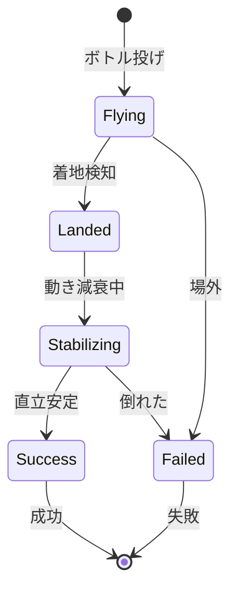

# ボトルフリップ物理機能

## 機能ID
`MAIN-FUNC-001`

## 概要
Rigidbodyを使用したボトルフリップの物理シミュレーション。

## 対象画面
- メインビュー画面 (`MAIN-SCR-001`)

## 物理パラメータ

### ボトル共通

| パラメータ | 値 | 説明 |
|------------|-----|------|
| mass | ボトル依存 | 質量（kg） |
| drag | 0.5 | 空気抵抗 |
| angularDrag | 0.5 | 回転抵抗 |
| useGravity | true | 重力使用 |

### 初速計算

```csharp
public class ThrowCalculator
{
    // 投げの初速を計算
    public static Vector3 CalculateInitialVelocity(float intensity, BottleData bottle)
    {
        // 基本上方向速度
        float baseUpwardSpeed = 5.0f + intensity * 3.0f;

        // ボトルの難易度による補正
        float difficultyMod = bottle.DifficultyModifier;

        return new Vector3(
            Random.Range(-0.5f, 0.5f),  // 微小なX方向ブレ
            baseUpwardSpeed * difficultyMod,
            Random.Range(-0.2f, 0.2f)   // 微小なZ方向ブレ
        );
    }

    // 回転の初速を計算
    public static Vector3 CalculateAngularVelocity(float intensity, BottleData bottle)
    {
        float baseRotation = 8.0f + intensity * 4.0f;

        return new Vector3(
            baseRotation,  // 前方向回転（フリップ）
            Random.Range(-1f, 1f),  // 微小なY軸回転
            0
        );
    }
}
```

## ボトル種類と物理特性

| ボトルタイプ | 質量 | 難易度補正 | 重心オフセット |
|--------------|------|------------|----------------|
| ペットボトル500ml | 0.5 | 1.0 | 0.0 |
| 1Lボトル | 1.0 | 1.1 | -0.1 |
| 缶 | 0.35 | 0.9 | 0.0 |
| ワインボトル | 1.5 | 1.3 | -0.15 |
| 牛乳パック | 1.0 | 0.8 | 0.0 |
| 魔法瓶 | 0.8 | 1.2 | -0.05 |

## 成功判定

### 判定条件

```csharp
public class FlipJudge
{
    private const float UPRIGHT_THRESHOLD = 15f;  // 直立判定角度（度）
    private const float STABLE_TIME = 0.5f;       // 安定必要時間（秒）
    private const float VELOCITY_THRESHOLD = 0.1f; // 速度しきい値

    public bool IsSuccessful(Bottle bottle)
    {
        // 直立判定
        float angle = Vector3.Angle(bottle.transform.up, Vector3.up);
        if (angle > UPRIGHT_THRESHOLD) return false;

        // 安定判定
        if (bottle.Rigidbody.velocity.magnitude > VELOCITY_THRESHOLD) return false;
        if (bottle.Rigidbody.angularVelocity.magnitude > VELOCITY_THRESHOLD) return false;

        // 接地判定
        if (!bottle.IsGrounded) return false;

        return true;
    }
}
```

### 判定フロー



## コリジョン設定

### レイヤー構成

| レイヤー | 説明 |
|----------|------|
| Bottle | ボトル |
| Table | テーブル |
| Floor | 床 |

### 物理マテリアル

```
BottlePhysicsMaterial:
  - dynamicFriction: 0.4
  - staticFriction: 0.4
  - bounciness: 0.2
  - frictionCombine: Average
  - bounceCombine: Average

TablePhysicsMaterial:
  - dynamicFriction: 0.6
  - staticFriction: 0.6
  - bounciness: 0.1
```

## ボトル生成

### 生成位置
- テーブル上のSpawnPointから生成
- Y座標は少し上から（自然な投げ開始）

### 生成処理

```csharp
public Bottle SpawnBottle(ThrowData data)
{
    // ボトルプレハブ取得
    var prefab = BottleDatabase.GetPrefab(data.BottleId);

    // 生成
    var bottle = Instantiate(prefab, spawnPoint.position, Quaternion.identity);

    // 初速設定
    var rb = bottle.GetComponent<Rigidbody>();
    rb.velocity = ThrowCalculator.CalculateInitialVelocity(data.Intensity, data.Bottle);
    rb.angularVelocity = ThrowCalculator.CalculateAngularVelocity(data.Intensity, data.Bottle);

    // プレイヤー情報紐付け
    bottle.SetOwner(data.PlayerId, data.PlayerName);

    return bottle;
}
```

## タイムアウト

- 最大判定時間: 10秒
- タイムアウト時は失敗扱い
