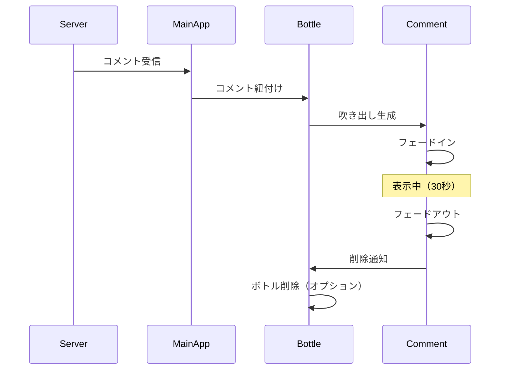

# コメント表示機能

## 機能ID
`MAIN-FUNC-003`

## 概要
ボトルの上に投稿されたコメントを吹き出し形式で表示する。

## 対象画面
- メインビュー画面 (`MAIN-SCR-001`)

## 表示仕様

### コメント吹き出し構成

```
    ┌─────────────────┐
    │ たろう          │
    │ やったー！      │
    └────────┬────────┘
             │
             ▼
         [ボトル]
```

### UI要素

| 要素ID | 種類 | 説明 |
|--------|------|------|
| canvas_comment | WorldSpaceCanvas | コメント用キャンバス |
| panel_bubble | Panel | 吹き出し背景 |
| txt_name | Text | プレイヤー名 |
| txt_comment | Text | コメント内容 |
| img_pointer | Image | 吹き出しの尖り部分 |

### ビルボード処理

```csharp
public class CommentBillboard : MonoBehaviour
{
    private Camera mainCamera;

    void LateUpdate()
    {
        // 常にカメラの方を向く
        transform.LookAt(
            transform.position + mainCamera.transform.rotation * Vector3.forward,
            mainCamera.transform.rotation * Vector3.up
        );
    }
}
```

## 表示パラメータ

| パラメータ | 値 | 説明 |
|------------|-----|------|
| OFFSET_Y | 0.5f | ボトル上のオフセット（m） |
| FADE_IN_TIME | 0.3f | フェードイン時間（秒） |
| DISPLAY_TIME | 30.0f | 表示時間（秒） |
| FADE_OUT_TIME | 1.0f | フェードアウト時間（秒） |
| MAX_COMMENTS | 20 | 同時表示最大数 |

## 表示フロー



## コメント管理

### 同時表示数制限
- 最大20件まで同時表示
- 超過時は古いものから削除

### 表示優先度
1. 最新のコメント
2. 成功時のコメント
3. 失敗時のコメント

### ボトル削除タイミング
- コメントなしの場合：即座に削除
- コメントありの場合：表示時間終了後に削除

## 演出

### フェードイン
```csharp
IEnumerator FadeIn()
{
    canvasGroup.alpha = 0;
    float elapsed = 0;

    while (elapsed < FADE_IN_TIME)
    {
        elapsed += Time.deltaTime;
        canvasGroup.alpha = elapsed / FADE_IN_TIME;
        yield return null;
    }

    canvasGroup.alpha = 1;
}
```

### ポップアップアニメーション
- スケール: 0 → 1.1 → 1.0（バウンス効果）
- 回転: 微小な揺れ

## スタイリング

### 成功時
- 背景色: 明るい緑 (#4CAF50)
- 枠: ゴールド
- パーティクル: 紙吹雪

### 失敗時
- 背景色: 薄い青 (#2196F3)
- 枠: シルバー
- パーティクル: なし

## テキスト処理

### 禁止ワードフィルター
- サーバー側でフィルタリング済みのテキストを表示
- クライアント側での追加フィルタリングは不要

### 絵文字対応
- Unity TextMeshProで絵文字表示対応
- フォント: Noto Color Emoji または同等
