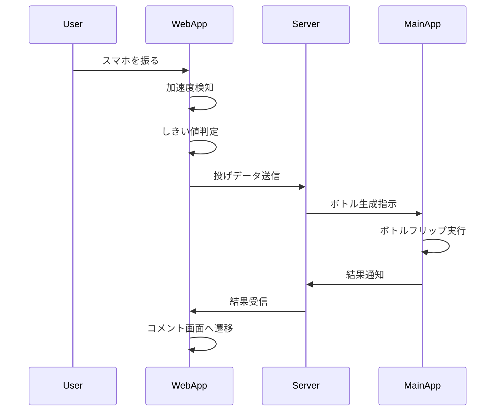

# 振り検知機能

## 機能ID
`WEB-FUNC-001`

## 概要
スマホの加速度センサーを使用して振り動作を検知し、ボトル投げアクションをトリガーする。

## 対象画面
- メイン画面 (`WEB-SCR-002`)

## 技術仕様

### 加速度センサーアクセス
```csharp
// UnityのInput.accelerationを使用
Vector3 acceleration = Input.acceleration;
```

### 振り検知パラメータ

| パラメータ | 値 | 説明 |
|------------|-----|------|
| SHAKE_THRESHOLD | 2.0f | 振り検知しきい値（G） |
| SHAKE_COOLDOWN | 1.0f | 連続検知防止クールダウン（秒） |
| SAMPLE_RATE | 60 | サンプリングレート（Hz） |

### 振り強度計算

```csharp
float CalculateShakeIntensity(Vector3 acceleration)
{
    // 重力を除去
    Vector3 linearAcceleration = acceleration - Vector3.down;

    // 強度計算（0.0 〜 1.0に正規化）
    float magnitude = linearAcceleration.magnitude;
    float intensity = Mathf.Clamp01((magnitude - SHAKE_THRESHOLD) / 3.0f);

    return intensity;
}
```

## データ送信

### 送信タイミング
- しきい値を超えた瞬間

### 送信データ
```json
{
    "type": "throw",
    "player_id": "xxx",
    "bottle_id": "yyy",
    "intensity": 0.75,
    "timestamp": 1234567890
}
```

## 処理フロー



## エラーハンドリング

| エラー | 対応 |
|--------|------|
| センサー非対応 | 画面タップでの代替入力を提供 |
| 通信エラー | リトライダイアログ表示 |

## 備考
- WebGL（ブラウザ）での加速度センサーアクセスには`DeviceMotionEvent`のパーミッション取得が必要（iOS 13+）
