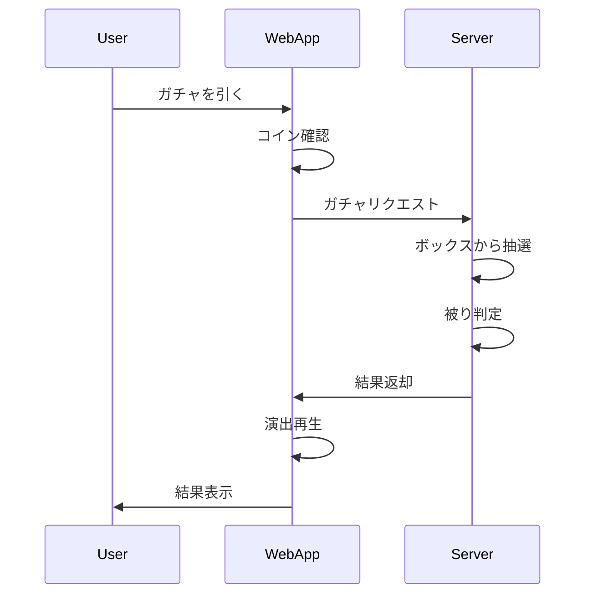

# ガチャシステム機能

## 機能ID
`WEB-FUNC-002`

## 概要
ボックスガチャ（一番くじ方式）でボトルを入手するシステム。

## 対象画面
- ガチャ画面 (`WEB-SCR-004`)
- ガチャ演出・結果画面 (`WEB-SCR-005`)

## ガチャ機仕様

### ガチャ機構成
- 3台のガチャ機が存在
- 各ガチャ機は独立したボックスを持つ
- 中身は全プレイヤーで共有（サーバー管理）

### ボックス内容（各ガチャ機共通）

| レア度 | 数量 | 排出確率（初期） |
|--------|------|------------------|
| ★5 | 1 | 2% |
| ★4 | 3 | 6% |
| ★3 | 10 | 20% |
| ★2 | 16 | 32% |
| ★1 | 20 | 40% |
| **合計** | **50** | **100%** |

### ボックスリセット
- 全て引き切ると自動リセット
- リセット時は初期状態に戻る

## コイン仕様

### 消費
- 1回: 100コイン

### 被り時の変換
| レア度 | 変換コイン |
|--------|------------|
| ★5 | 200 |
| ★4 | 100 |
| ★3 | 50 |
| ★2 | 30 |
| ★1 | 20 |

## API連携

### ガチャ内容取得
```
GET /api/gacha/{machine_id}/contents
```

Response:
```json
{
    "machine_id": 1,
    "total": 50,
    "remaining": 45,
    "contents": [
        {"bottle_id": "B001", "rarity": 5, "available": true},
        {"bottle_id": "B002", "rarity": 4, "available": false},
        ...
    ]
}
```

### ガチャ実行
```
POST /api/gacha/{machine_id}/pull
```

Request:
```json
{
    "player_id": "xxx"
}
```

Response:
```json
{
    "success": true,
    "bottle": {
        "bottle_id": "B003",
        "name": "ペットボトル",
        "rarity": 3,
        "is_new": true
    },
    "coins_spent": 100,
    "coins_earned": 0,
    "remaining_coins": 150
}
```

## 演出システム

### 演出トリガー
- レア度判定はサーバーから結果を受け取ってから演出開始
- 演出中も結果は確定済み

### 演出時間
| レア度 | 演出時間 |
|--------|----------|
| ★1〜2 | 1.0秒 |
| ★3 | 2.0秒 |
| ★4 | 3.0秒 |
| ★5 | 4.0秒 |

### スキップ
- 演出中タップでスキップ可能
- スキップ後は即座に結果表示

## 処理フロー



## エラーハンドリング

| エラー | 対応 |
|--------|------|
| コイン不足 | 「コインが足りないよ！」表示 |
| ボックス空 | 「SOLD OUT」表示、他のガチャ機を案内 |
| 通信エラー | リトライダイアログ |
