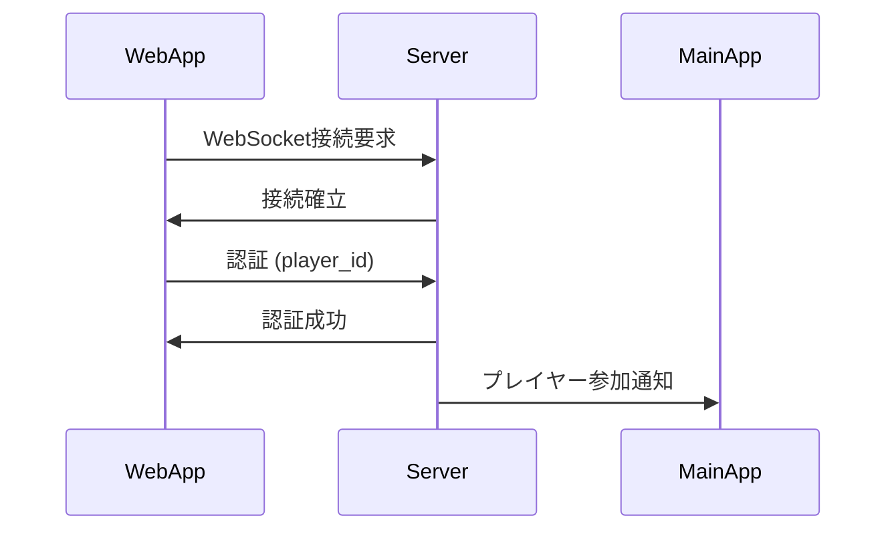

# 通信機能

## 機能ID
`WEB-FUNC-003`

## 概要
Webアプリと母艦アプリ間のリアルタイム通信を管理する。

## 通信方式

### WebSocket
- リアルタイム性が必要な通信に使用
- ボトル投げ、結果通知など

### REST API
- 状態取得、データ更新に使用
- プレイヤー情報、ガチャなど

## 接続フロー



## WebSocket イベント

### クライアント → サーバー

| イベント名 | 説明 | データ |
|------------|------|--------|
| `auth` | 認証 | `{player_id}` |
| `throw` | ボトル投げ | `{bottle_id, intensity}` |
| `comment` | コメント投稿 | `{comment}` |
| `skip_comment` | コメントスキップ | `{}` |

### サーバー → クライアント

| イベント名 | 説明 | データ |
|------------|------|--------|
| `auth_success` | 認証成功 | `{player_data}` |
| `throw_result` | 投げ結果 | `{success, coins_earned}` |
| `error` | エラー | `{code, message}` |

## REST API エンドポイント

### プレイヤー関連

| メソッド | パス | 説明 |
|----------|------|------|
| POST | `/api/players` | プレイヤー登録 |
| GET | `/api/players/{id}` | プレイヤー情報取得 |
| PUT | `/api/players/{id}/bottle` | 選択ボトル変更 |

### ガチャ関連

| メソッド | パス | 説明 |
|----------|------|------|
| GET | `/api/gacha` | ガチャ機一覧 |
| GET | `/api/gacha/{id}/contents` | ガチャ内容 |
| POST | `/api/gacha/{id}/pull` | ガチャを引く |

### ボトル関連

| メソッド | パス | 説明 |
|----------|------|------|
| GET | `/api/bottles` | ボトルマスタ一覧 |
| GET | `/api/players/{id}/bottles` | 所持ボトル一覧 |

## 接続状態管理

### 状態

| 状態 | 説明 |
|------|------|
| `disconnected` | 未接続 |
| `connecting` | 接続中 |
| `connected` | 接続済み |
| `authenticated` | 認証済み |
| `reconnecting` | 再接続中 |

### 自動再接続
- 切断時は自動で再接続を試行
- 最大5回まで、指数バックオフで再試行
- 再接続間隔: 1秒 → 2秒 → 4秒 → 8秒 → 16秒

## ローカルストレージ

### 保存データ
```json
{
    "player_id": "xxx",
    "player_name": "たろう",
    "selected_bottle_id": "B001"
}
```

### オフライン対応
- プレイヤー情報はローカルに保存
- 再起動時は保存データで自動ログイン
